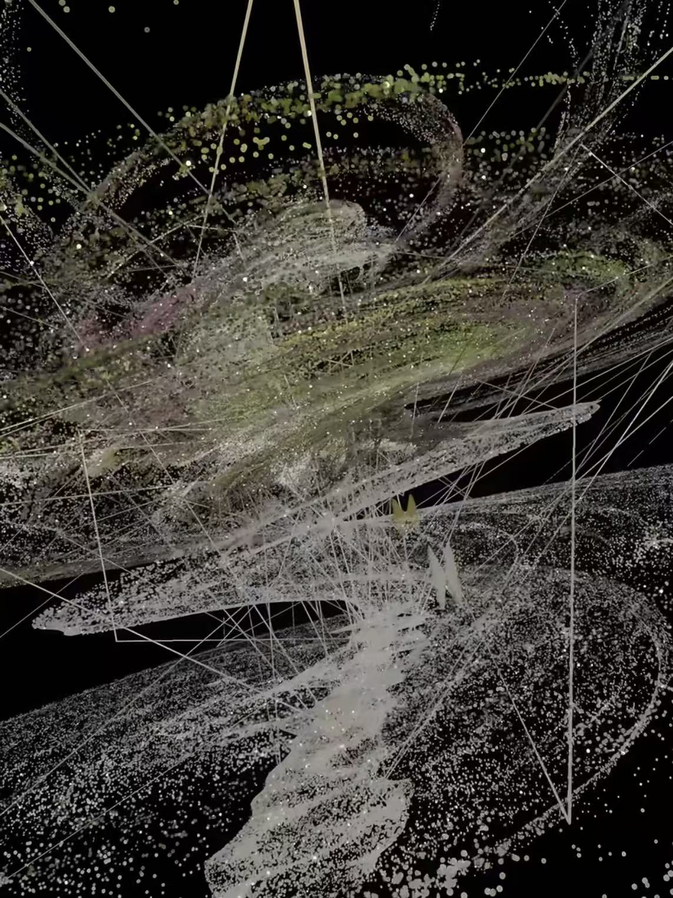
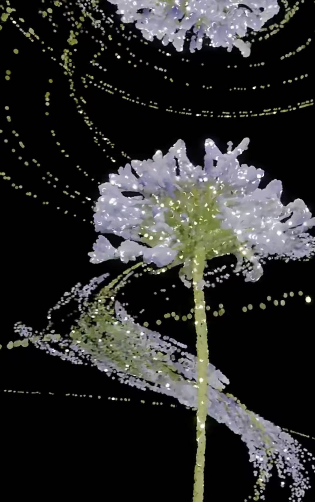

# Quiz 8

##  Imaging Technique Inspiration
The creative concept of this project draws inspiration from the series *My Plants* by artist **Nanooooh**

These artworks simulate the sense of depth one experiences when wandering through the universe, allowing static starry skies to present a romantic, layered visual effect——like witnessing the stunning beauty and uniqueness of the universe blooming into flowers.

### Main Imaging Logic
- [Main1: Dynamic light and shadow gradients]
- [Main2: Geometric transformations of spatial dimensions]

### Based on the consideration of the assignment requirements
It can perfectly presnet clear lines and geometric figures with rich layers.

### Reference Images
- 
- 

