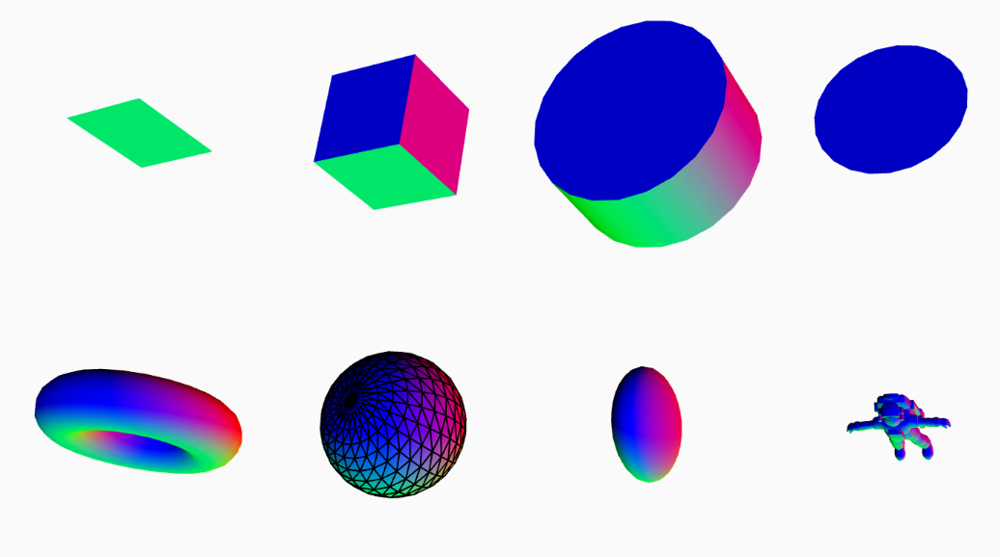

# Quiz 8

##  Imaging Technique Inspiration
The creative concept of this project draws inspiration from the series *My Plants* by artist **Nanooooh**

These artworks simulate the sense of depth one experiences when wandering through the universe, allowing static starry skies to present a romantic, layered visual effect——like witnessing the stunning beauty and uniqueness of the universe blooming into flowers.

### Main Imaging Logic
-  Geometric transformations of spatial dimensions

### Based on the consideration of the assignment requirements
It can perfectly presnet clear lines and geometric figures with rich layers.

### Reference Images
- 
- 

## Coding Technique Exploration
I have identified 3D coding techniques, which can help me achieve the expected effect.

### 3D Coding Technique Advantages
- Achieve clear **spatial depth** to build a layered scene 
- Generate realistic **light and shadow effects** that echo the dynamic illumination in the imaging inspiration.  
- Support smooth **object rotation** coordinated with interactions like OrbitControl, enhancing the experience of "wandering through the scene".

### Reference Images

